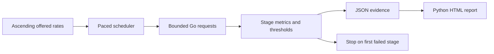

# API Pressure Lab

**Find the highest API load that meets your latency and error budget — and reproduce the experiment.**

A Go load generator and Python analysis toolkit for staged capacity tests, SQL-injection regression checks, and standalone HTML reports. Standard libraries only. Built as an inspectable engineering project: the methodology, tests, limitations, and local demo ship with the code.

## What it measures

- Requests scheduled at increasing offered rates, with bounded concurrency.
- p50, p95, p99 response latency, completed throughput, failures, and dropped arrivals.
- Highest **tested** offered rate meeting a chosen p95 and error-rate budget.
- Generator saturation separately from API failures.
- Potential SQL-injection signals using controlled GET probes, separately from load testing.

Capacity is specific to the endpoint, hardware, request mix, and test duration. This tool does not claim a universal maximum. A passing final stage means the limit was not found.

## Quick start

Requirements: Go 1.23+ and Python 3.11+. No package installation is required.

```sh
git clone https://github.com/ShubhamSingh047/api-pressure-lab.git
cd api-pressure-lab
go build -o bin/pressure ./cmd/pressure
python3 -m pressurelab.demo
```

In another terminal:

```sh
./bin/pressure --url http://127.0.0.1:8080/work \
  --rates 10,25,50,100 --duration 5s --workers 32 \
  --p95 250ms --max-error-rate 0.01 --output results.json
python3 -m pressurelab.report --input results.json --output report.html
```

Open `report.html` in a browser. The load command returns **2** when a stage misses its limits; the JSON still contains the complete experiment. Exit **0** means all stages passed, **1** means invalid input/output failure, and **130** means interrupted.

## Security regression checks

Only test systems you own or have permission to test. The included demo binds to loopback and uses disposable SQLite fixtures. Start it with `--vulnerable` to demonstrate an intentionally unsafe query; omit that flag to test the parameterized version.

```sh
python3 -m pressurelab.security --url http://127.0.0.1:8080/items \
  --param q --value apple --output security.json
```

The check reports **potential** SQL injection, not proof of exploitability. A negative result does not prove security. It uses bounded requests, stable baselines and controls; it does not dump data, mutate the database, or follow redirects.

## How the load test works



The scheduler uses deadlines relative to stage start. Missed slots and occupied workers count as dropped arrivals instead of building an unbounded queue. Requests have timeouts and a 1 MiB response limit. Redirects are not followed. Only completed 2xx responses count as successful. All completed attempts, including failed attempts, contribute latency samples; percentiles use nearest rank.

`achieved_rps` counts completed attempts divided by actual stage elapsed time, including draining outstanding requests. `error_rate` is failures divided by completed attempts; drops are reported separately and always fail the stage. Status `0` means no HTTP response was received. Interrupted partial stages cannot establish capacity. Target query values are omitted from results; avoid secrets in URL paths.

Use `--authorized` for non-loopback load targets. v1 supports GET requests only, with no custom authentication headers, request bodies, distributed workers, server-side resource monitoring, or warm-up phase. Repeat longer tests with representative traffic before making deployment decisions. A single local demo is not a production benchmark.

## Development

```sh
go test -race ./...
go vet ./...
python3 -m unittest discover -s tests -v
python3 scripts/demo_experiment.py --output-dir examples
```

The test suite exercises real local HTTP servers, cancellation, worker saturation, response limits, security controls, and HTML escaping. See [the design](docs/design.md) for the JSON contract.

The experiment script starts and stops its own loopback servers. Its capacity demo uses two simulated workers with 100 ms work per request and tests 5, 10, then 30 offered requests per second. It also checks parameterized and deliberately vulnerable SQL variants. Saved [example results](examples/capacity.json) are synthetic local measurements, not production benchmark claims.

## Repository history

This repository began as a JavaScript card-game exercise. Its original commits and game files (`index.html`, `Deck.js`, `script.js`, and `style.css`) are preserved. API Pressure Lab was added in September 2026.

## Why this project

This project makes concurrency control, load-generation accuracy, experimental limits, secure query handling, and reproducible reporting visible in a small codebase. Future work: request scenarios, authenticated requests, warm-up/repeat runs, histograms, and comparison of saved experiments.

## License

MIT. See [LICENSE](LICENSE).

<!-- Documentation polish (2026-09-15 21:56:22) -->
